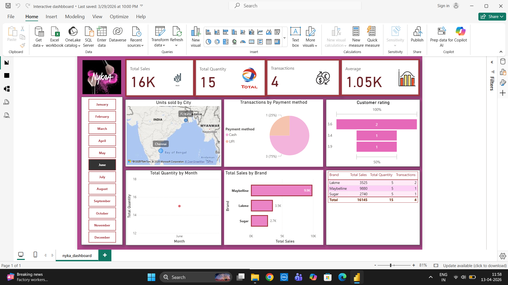
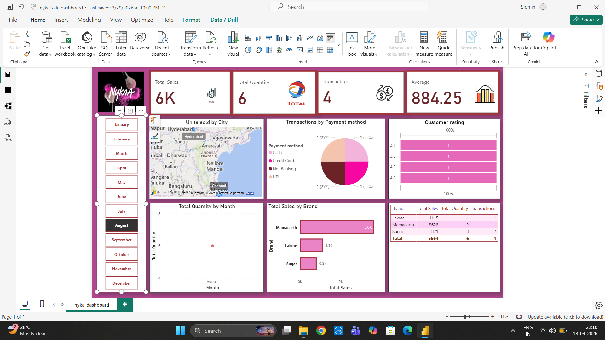

# Nykaa Sales Power BI Dashboard 📊

## Files Included
- Nykaa Sales Dataset
- Power BI Dashboard

## Project Overview
This project presents an interactive PowerBI dashboard built to analyze Nykaa sales data. It focuses on key business metrics such as sales performance, customer behavior, brand trends, and geographic distribution.

## Objectives
- Analyze sales performance across different months
- Understand customer purchasing behavior
- Identify top-performing brands
- Explore regional sales distribution

## Key Insights
- Sales analysis is dynamic using a monthly slicer, allowing filter-based insights
- Customers tend to purchase multiple items per transaction (bundle behavior)
- Brand performance varies across months, indicating changing customer preferences
- Sales are concentrated in specific regions, highlighting expansion opportunities
- Payment methods are evenly distributed between cash and card
- Customer ratings indicate moderate satisfaction with scope for improvement

## Tools & Technologies
- Power BI
- DAX (Measures)
- Data Visualization
- Data Analysis
 
## Dashboard Preview
### June Dashboard

### August Dashboard

## Conclusion
The dashboard provides meaningful insights into sales trends and customer behavior. It helps in identifying growth opportunities through better marketing strategies, improved customer experience, and regional expansion.
